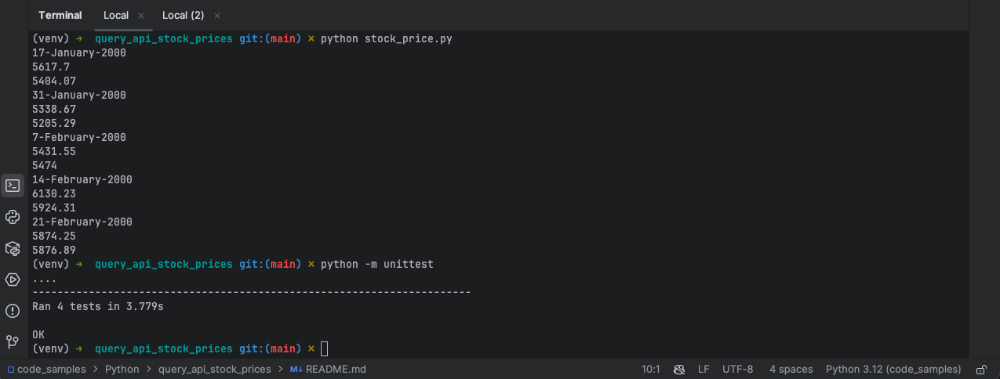

# Query API (Stock Prices)

Coding challenge for a job opening.

Challenge: given a range of dates, query the price of stocks on 
opening and closing for a specific weekday.

- Code originally written in 2019. Minimally (insecurely) adjusted to run without SSL. 
- Test cases added in 2019.

How to run:
```bash
$ python3 -m venv myvenv
$ source myvenv/bin/activate
(myvenv)$ pip install -r requirements.txt
(myvenv)$ python  
(myvenv)$ python -m unittest
```

# Run
