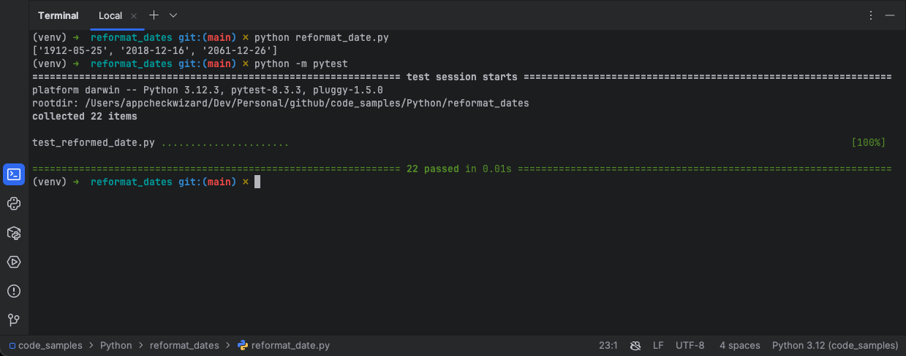

# Reformat Dates

Coding challenge for a job opening.

Challenge: given a sample array of dates, convert it to ISO format.

- Code originally written in 2019.
- Revisited in 2024 to add a full test suite.
- Adding tests surfaced several edge case bugs (whitespace, invalid suffixes, 
  non-string inputs) that were silently failing in the original code.
- Code refactored in 2026 to pass the tests.

How to run:
```bash
$ python3 -m venv myvenv
$ source myvenv/bin/activate
(myvenv)$ pip install -r requirements.txt
(myvenv)$ python reformat_date.py 
(myvenv)$ python -m pytest
```

# Run


